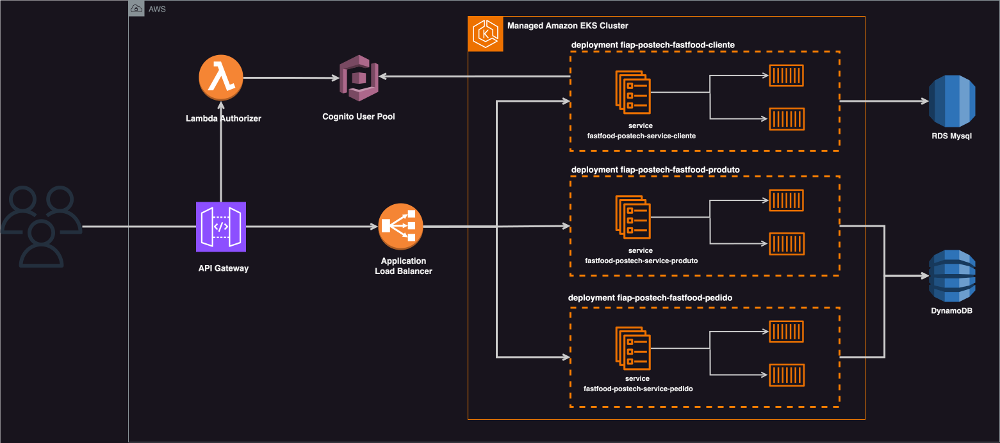
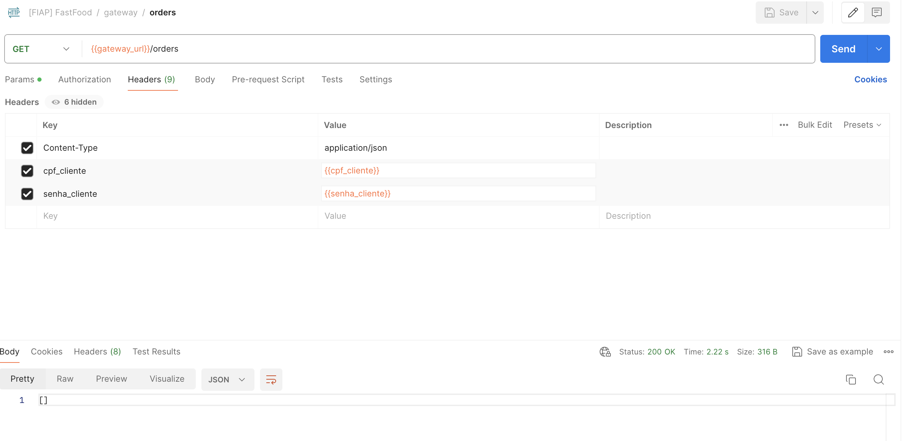

# 🚀 FIAP : Challenge Pós-Tech Software Architecture
## 🍔 Projeto Fast Food |  Infraestrutura na Cloud (ApiGateway e Cognito User Pools)

Projeto realizado para a Pós-Graduação de Arquitetura de Sistemas da FIAP. Criação de um sistema de autoatendimento para uma lanchonete.

<br/>

### 👨‍🏫 Grupo

Integrantes:
- Giovanna H. B. Albuquerque (RM352679)

<br/>

### 📍 DDD

Estudos de Domain Driven Design (DDD) como Domain StoryTelling, EventStorming, Linguagem Ubíqua foram feitos na ferramenta MIRO pelo grupo.
Os resultados destes estudos estão disponíveis no link abaixo:

**🔗 MIRO com DDD: https://miro.com/app/board/uXjVNMo8BCE=/?share_link_id=24975843522**

<br/>

### 📐 Desenho de Solução (Arquitetura)

Solução arquitetônica realizada (Cloud AWS) completa:


<br/>

### 💻 Tecnologias

Tecnologias utilizadas no projeto:

* Cloud AWS
* Terraform
* Python
* Java

<br/>

## 🎬 Como executar este projeto?

Compõem esta entrega:
> * Repositório da Lambda de Autenticação
>   * https://github.com/GHBAlbuquerque/fiap-postech-lambda-auth-fastfood
> * Repositório da Infra (EKS, Load Balancer, Security Group)
>   * https://github.com/GHBAlbuquerque/fiap-postech-infra-fastfood-eks
> * Repositório da Infra (ApiGateway e Cognito User Pools)
>   * https://github.com/GHBAlbuquerque/fiap-postech-infra-fastfood
> * Repositório das Tabelas Dynamo
>    * https://github.com/GHBAlbuquerque/fiap-postech-infra-dynamo
> * Repositório da Base de Dados RDS
>    * https://github.com/GHBAlbuquerque/fiap-postech-infra-rds
> * Repositório da App de Cliente
>    * https://github.com/GHBAlbuquerque/fiap-postech-fastfood-cliente
> * Repositório da App de Produto
>    * https://github.com/GHBAlbuquerque/fiap-postech-fastfood-produto
> * Repositório da App de Pedido
>    * https://github.com/GHBAlbuquerque/fiap-postech-fastfood-pedido

<br/>

### 💿 Getting started - Rodando com CICD e infra descentralizada na Cloud AWS

Faça o download ou clone este projeto e abra em uma IDE (preferencialmente IntelliJ).
É preciso ter:

    - Uma conta cadastrada na Cloud AWS / AWS Academy

<br/>

Antes de iniciar:
1. Criar manualmente bucket s3 na conta com para guardar os states do terraform (utilizei o nome ‘terraform-state-backend-postech-new’)
2. Criar manualmente repositórios ECR na conta com os nomes ‘fiap_postech_fastfood_cliente’, ‘fiap_postech_fastfood_produto’ e ‘fiap_postech_fastfood_pedido’
3. Caso não esteja usando AWS Academy, é necessário criar também Policies e Roles para os serviços. Esta etapa não foi feita na entrega da Pós e foram usadas as Roles padrão do laboratório.

Passo-a-passo:
1. Obtenha credenciais de aws_access_key_id, aws_secret_access_key e aws_session_token da sua conta na AWS Academy ou na AWS.
2. Altere credenciais nos secrets para actions dos repositórios
3. Altere credenciais no arquivo .credentials na pasta .aws no seu computador caso deseje rodar a aplicação localmente ou usar o aws cli

<br/>

> Subindo a Infraestrutura do projeto (LoadBalancer, Security Group e EKS Cluster)
1. Ajuste o bucket para armazenamento de estado **Repositório da Infra EKS**
    1.   backend "s3" { bucket  = "${SEU BUCKET}" ... } -> arquivo main.tf
2. Ajuste variáveis e segredos de Actions para CI/CD no arquivo terraform.tfvars
3. Suba infraestrutura via CICD do repositório (LoadBalancer, Security Group e EKS Cluster)
4. Ajuste o Security Group gerado automaticamente pelo cluster 
   1. Libere 'Todo o Tráfego' para a VPC (ver CIDR)
   2. Libere 'Todo o Tráfego' para o Security Group criado manualmente e usado no ALB (obter id do security group)

<br/>

> Subindo as tabelas Dynamo
1. Ajuste o bucket para armazenamento de estado **Repositório das Tabelas Dynamo**
    1.   backend "s3" { bucket  = "${SEU BUCKET}" ... } -> arquivo main.tf
2. Ajuste variáveis e segredos de Actions para CI/CD no arquivo terraform.tfvars
3. Suba infraestrutura via CICD do repositório

<br/>

> Subindo o Banco de Dados RDS
1. Ajuste o bucket para armazenamento de estado **Repositório da Base de Dados RDS**
    1.   backend "s3" { bucket  = "${SEU BUCKET}" ... } -> arquivo main.tf
2. Ajuste variáveis e segredos de Actions para CI/CD no arquivo terraform.tfvars
3. Suba infraestrutura via CICD do repositório

<br/>

> Subindo a App de Cliente
1. TBD
2. Corrigir DB_HOST mudando o endpoint do RDS no arquivo manifest
```
1. Abra o **Repositório da App**
2. Ajuste segredos de Actions para CI/CD no repositório
3. Ajuste URI do repositório remoto ECR AWS (accountid e region) no repositório da aplicação, arquivo infra-kubernetes/manifest.yaml
4. Suba a aplicação via CI/CD do repositório
5. Verifique componentes em execução na AWS
6. Obtenha url do estágio no API Gateway para realizar chamadas -> API Gateway / APIs / api_gateway_fiap_postech (xxxxx) / Estágios : Invocar URL
7. Para chamar o swagger da aplicação e ver os endpoints disponíveis, acesse: {{gateway_url}}/swagger-ui/index
8. Para realizar chamadas aos endpoints http do gateway, utilize os seguintes headers:
   1. cpf_cliente -> valor cadastrado previamente: 93678719023
   2. senha_cliente -> valor cadastrado previamente: FIAPauth123_
```

<br/>

> Subindo a App de Produto
1. TBD

<br/>

> Subindo a App de Pedido
1. TBD

<br/>

> Subindo a Lambda de Autenticação
1. Ajuste o bucket para armazenamento de estado **Repositório da Lambda de Autenticação**
    1.   backend "s3" { bucket  = "${SEU BUCKET}" ... } -> arquivo main.tf
2. Ajuste variáveis e segredos de Actions para CI/CD no arquivo terraform.tfvars
3. Suba a lambda via CICD do repositório
4. Após a criação do Cognito no passo 'Subindo a Infraestrutura do projeto (Api Gateway e Cognito User Pools)':
    1. Obtenha o ID do Cliente do Cognito na aba 'Integração da Aplicação', sessáo 'Análise e clientes de aplicação'
    2. Mude o ClientId do cognito -> arquivo lambda_auth.py (client_id)
5. Faça deploy da Lambda novamente

<br/>

> Subindo a Infraestrutura do projeto (Api Gateway e Cognito User Pools)
1. Ajuste o bucket para armazenamento de estado **Repositório da Infra**
    1.   backend "s3" { bucket  = "${SEU BUCKET}" ... } -> arquivo main.tf
2. Ajuste variáveis e segredos de Actions para CI/CD no arquivo terraform.tfvars
3. Suba infraestrutura via CICD do repositório (Api Gateway e Cognito User Pools)
4. Ajuste um bug do autorizador do API Gateway que mostra erro 500 e mensagem ‘null’:
    1. Vá em ‘Autorizadores’
    2. Selecione ‘lambda_authorizer_cpf’ e editar
    3. Escolha a função lambda da lista
    4. Salve alterações
    5. Realize deploy da API no estágio ("Implantar API")
5. Teste a conexão chamando o DNS do loadbalancer na url: ``{DNS Load Balancer}/actuator/health``
6. Obtenha endereço do stage do API Gateway no console para realizar chamadas
    1. Vá em API Gateway > api_gateway_fiap_postech > estágios > pegar o valor Invoke Url

<br/>

> (opcional) Criar usuário e utilizar
1. Crie um usuário utilizando o endpoint POST '/clients'
2. O username será o cpf informado
3. Pegue o código de verificação enviado para o e-mail
4. Confirme a criação do usuário para permitir o uso em endpoints: envie uma requisição para o endpoint POST '/clients/confirmation' (utilizando cpf e o código)
5. Utilize o cpf e senha cadastrados para fazer solicitações como orientado acima

Ex. de chamada:


<br/>

## Autores

*Giovanna Albuquerque* [@GHBAlbuquerque](https://github.com/GHBAlbuquerque)

*FIAP*  [@FIAP Software Architecture](https://postech.fiap.com.br/curso/software-architecture/)

Feito em 2024