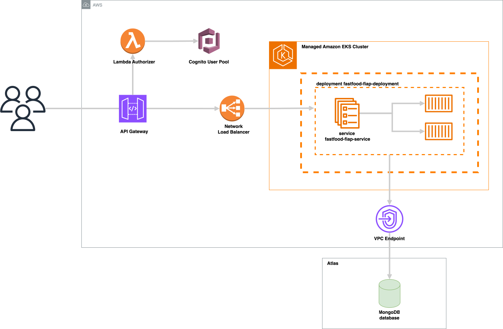

# 🚀 FIAP : Challenge Pós-Tech Software Architecture
## 🍔 Projeto Fast Food | Infraestrutura na Cloud (ApiGateway e Cognito User Pools)

Projeto realizado para a Fase 3 da Pós-Graduação de Arquitetura de Sistemas da FIAP. Respositório de infra (EKS, Load Balancer, Security Group, ApiGateway, Cognito User Pools) para criação de recursos do Tech Challenge.


### 👨‍🏫 Grupo

Integrantes:
- Giovanna H. B. Albuquerque (RM352679)

### 📍 DDD

Estudos de Domain Driven Design (DDD) como Domain StoryTelling, EventStorming, Linguagem Ubíqua foram feitos na ferramenta MIRO pelo grupo.
Os resultados destes estudos estão disponíveis no link abaixo:

**🔗 MIRO com DDD: https://miro.com/app/board/uXjVNMo8BCE=/?share_link_id=24975843522**

### 📐 Desenho de Solução (Arquitetura)

Solução arquitetônica realizada (Cloud AWS) completa:


### 💻 Tecnologias

Tecnologias utilizadas no projeto:

* Cloud AWS
* Terraform
* Python
* Java

## 🎬 Como executar este projeto?

### Rodando com CICD e infra descentralizada

Compõem esta entrega:
* Repositório da Lambda de Autenticação - https://github.com/GHBAlbuquerque/fiap-postech-lambda-auth-fastfood
* Repositório da Infra (EKS, Load Balancer, Security Group) - https://github.com/GHBAlbuquerque/fiap-postech-infra-fastfood-eks
* Repositório da Infra (ApiGateway e Cognito User Pools) - https://github.com/GHBAlbuquerque/fiap-postech-infra-fastfood
* Repositório das Tabelas Dynamo - https://github.com/GHBAlbuquerque/fiap-postech-infra-dynamo
* Repositório da Base de Dados RDS - https://github.com/GHBAlbuquerque/fiap-postech-infra-rds
* Repositório da App de Cliente - https://github.com/GHBAlbuquerque/fiap-postech-fastfood-cliente
* Repositório da App de Produto - https://github.com/GHBAlbuquerque/fiap-postech-fastfood-produto
* Repositório da App de Pedido - https://github.com/GHBAlbuquerque/fiap-postech-fastfood-pedido


Faça o download ou clone este projeto e abra em uma IDE (preferencialmente IntelliJ).
É preciso ter:

    - Uma conta cadastrada na Cloud AWS

### 💿 Getting started - Rodando em cluster kubernetes + Load balancer + Api Gateway na AWS

Antes de iniciar:
1. Criar manualmente bucket s3 na conta com para guardar os states do terraform (utilizei o nome ‘terraform-state-backend-postech-new’)
2. Criar manualmente repositórios ECR na conta com os nomes ‘fiap_postech_fastfood_cliente’, ‘fiap_postech_fastfood_produto’ e ‘fiap_postech_fastfood_pedido’
3. Caso não esteja usando AWS Academy, é necessário criar também Policies e Roles para os serviços. Esta etapa não foi feita na entrega da Pós e foram usadas as Roles padrão do laboratório.

Passo-a-passo:
1. Obtenha credenciais de aws_access_key_id, aws_secret_access_key e aws_session_token da AWS Lab na AWS Academy ou na sua conta AWS.
2. Altere credenciais nos secrets para actions dos repositórios
3. Altere credenciais no arquivo .credentials na pasta .aws no seu computador

> Subindo a Lambda de Autenticação
1. Ajuste variáveis e segredos de Actions para CI/CD no **Repositório da Lambda de Autenticação**
   1. Lambda Role
   2. Bucket armazenador dos states terraform -> arquivo main.tf
   3. ClientId do cognito, no arquivo lambda_auth.py (client_id)
2. Suba a lambda via CICD do repositório

> Subindo a Infraestrutura do projeto (LoadBalancer, Security Group e EKS Cluster)
1. Ajuste variáveis e segredos de Actions para CI/CD no **Repositório da Infra EKS**
   1. AccountId
   2. Role Arn
   3. VPC Id
   4. VPC CIDR
   5. subnets
   6. Bucket armazenador dos states terraform -> arquivo main.tf
2. Ajuste a variável VPC_ID no arquivo .github/workflows/deploy-pipeline
3. Suba infraestrutura via CICD do repositório (LoadBalancer, Security Group e EKS Cluster)
4. Ajuste Security Group gerado automaticamente pelo cluster para liberar tráfego da VPC (ver CIDR) e do Security Group usado no ALB (id). Liberar ‘Todo o Tráfego’.


> Subindo a Infraestrutura do projeto (Api Gateway e Cognito User Pools)
1. Ajuste variáveis e segredos de Actions para CI/CD no **Repositório da Infra**
   1. AccountId
   2. Nome da Lambda
   3. Arn da Lambda criada para autenticação
   4. Role Arn
   5. VPC Id
   6. VPC CIDR
   7. subnets
   8. Bucket armazenador dos states terraform -> arquivo main.tf
2. Suba infraestrutura via CICD do repositório (Api Gateway e Cognito User Pools)
3. Ajuste bug do autorizador do API Gateway que monstra erro 500 e mensagem ‘null’:
   1. Ir em ‘Autorizadores’
   2. Selecionar ‘lambda_authorizer_cpf’ e editar
   3. Escolher a função lambda da lista
   4. Salvar alterações
   5. Realizar deploy da API no estágio
4. Teste conexão chamando o DNS do loadbalancer na url: ``{DNS Load Balancer}/actuator/health``
5. Obtenha endereço do stage do API Gateway no console para realizar chamadas
   1. Vá em API Gateway > api_gateway_fiap_postech > estágios > pegar o valor Invoke Url

> Subindo as tabelas Dynamo
1. TBD

> Subindo o Banco de Dados RDS
1. TBD
2. Corrigir DB_HOST mudando o endpoint do RDS no arquivo manifest

> Subindo a App de Cliente
1. TBD
```
1. Abra o **Repositório da App**
2. Ajuste segredos de Actions para CI/CD no repositório
3. Ajuste URI do repositório remoto ECR AWS (accountid e region) no repositório da aplicação, arquivo infra-kubernetes/manifest.yaml
4. Suba a aplicação via CI/CD do repositório
5. Verifique componentes em execução na AWS
6. Obtenha url do estágio no API Gateway para realizar chamadas -> API Gateway / APIs / api_gateway_fiap_postech (xxxxx) / Estágios : Invocar URL
7. Para chamar o swagger da aplicação e ver os endpoints disponíveis, acesse: {{gateway_url}}/swagger-ui/index
8. Para realizar chamadas aos endpoints http do gateway, utilize os seguintes headers:
   1. cpf_cliente -> valor cadastrado previamente: 93678719023
   2. senha_cliente -> valor cadastrado previamente: FIAPauth123_
```

> Subindo a App de Produto
1. TBD

> Subindo a App de Pedido
1. TBD

> (opcional) Criar usuário e utilizar
1. Crie um usuário utilizando o endpoint POST '/clients'
2. O username será o cpf informado
3. Pegue o código de verificação enviado para o e-mail
4. Confirme a criação do usuário para permitir o uso em endpoints: envie uma requisição para o endpoint POST '/clients/confirmation' (utilizando cpf e o código)
5. Utilize o cpf e senha cadastrados para fazer solicitações como orientado acima

Ex. de chamada:


